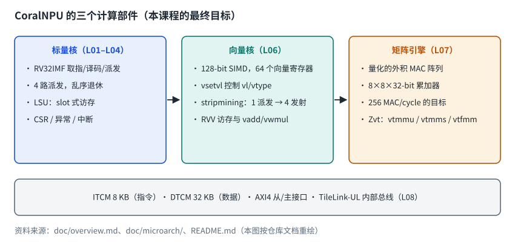
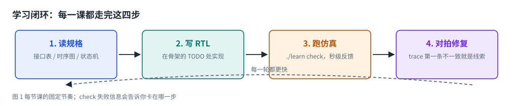
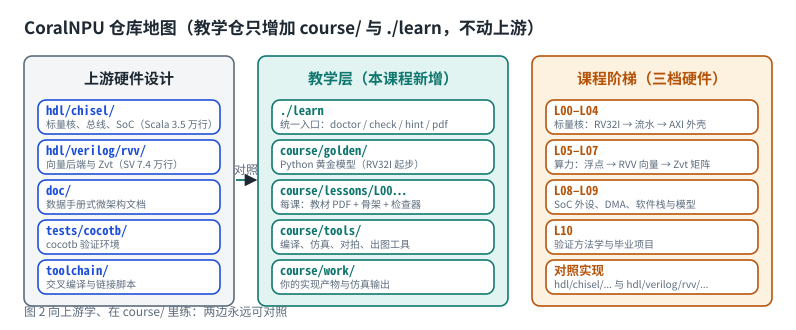
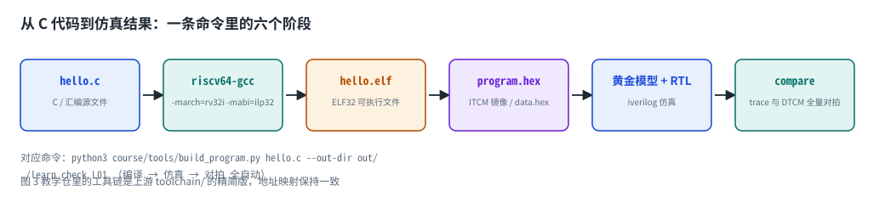
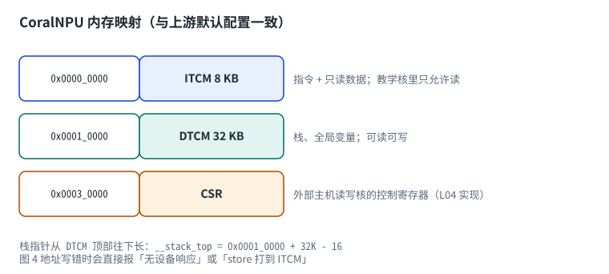

# 第 1 章　这门课要造什么

## 1.1 CoralNPU 是什么

CoralNPU 是 Google Research 开源的 NPU（神经网络处理器，也叫 AI 加速器）IP，
面向耳机、AR 眼镜、智能手表这类超低功耗 SoC。它基于 32 位 RISC-V 指令集，
由**三个计算部件**协同工作：



| 部件 | 作用 | 上游位置 | 本课程阶段 |
| --- | --- | --- | --- |
| 标量核 | 取指、译码、派发、控制流、地址计算 | `hdl/chisel/src/coralnpu/scalar/` | L01–L04 |
| 向量核 | 128-bit SIMD，做逐元素计算 | `hdl/verilog/rvv/`、`RvvCore.scala` | L05–L06 |
| 矩阵引擎 | 量化的外积 MAC，做卷积/矩阵乘 | `hdl/verilog/rvv/design/Zvt/` | L07 |

为什么 AI 加速器要有三个部件？因为神经网络的计算有两种截然不同的形态：

* **矩阵乘/卷积**：占绝大多数量，需要大阵列并行（矩阵引擎，目标是 256 MAC/cycle）；
* **逐元素运算与激活函数**：数量少但种类多，需要灵活（向量核）；
* **控制与地址计算**：循环、分支、指针运算（标量核）。

上游用「标量核 + 命令队列 + SIMD 后端」把三者融合在一起，这也是它和普通 CPU 的最大差别。

## 1.2 本课程的路线

我们不会一上来就读 7 万行 SystemVerilog，而是**自己从零造一遍**：

| 阶段 | 你实现的东西 | 验收方式 |
| --- | --- | --- |
| L00 | 环境、工具链、第一个 RTL 模块 | 4 个作业全通过 |
| L01 | RV32I 单周期核 | 跑通汇编测试与真实 C 程序 |
| L02–L04 | 访存子系统、流水线与冒险、AXI 外壳与启动 | 与上游文档规格对齐 |
| L05–L07 | 浮点、向量（RVV）、矩阵（Zvt/VME） | 跑通上游的 intrinsic / matmul 测试程序 |
| L08–L09 | 总线外设与 DMA、软件栈与模型 | 端到端跑通一个小模型 |
| L10 | 验证方法学与毕业项目 | 自己的核 + 自选模型 |

每一课都有三样东西：**两本 PDF**（基础知识 + 作业说明）、**一份骨架代码**、**一个自动检查器**。

# 第 2 章　怎么学：一个闭环，三层地图

## 2.1 学习闭环



每节课都走这四步，绝不跳过第三步：

1. 读规格（本课的「基础知识」PDF 与上游文档）；
2. 在骨架的 TODO 处写 RTL；
3. 跑 `./learn check`，拿到具体到某一条指令的失败信息；
4. 修复，再跑一次。

::: {.callout}
**为什么强调自动检查？** 硬件开发和写软件最大的区别是「看不见」。
没有检查器时，你只能盯着波形猜；有检查器时，它会告诉你
「第 27 条指令 `sra t4, t1, t1` 期望 0xffffffff，你算出 0x00ffffff」——
这是从「猜」到「读错误信息」的质变。
:::

## 2.2 仓库地图



这个仓库有两种东西，请严格区分：

* **上游内容**（不要改）：Chisel 写的核与 SoC、SystemVerilog 写的向量后端、
  数据手册式的文档、cocotb 验证环境、上游工具链；
* **教学层**（你工作的地方）：`course/` 目录与根目录的 `./learn` 命令。

教学层的答案永远可以回到上游验证：比如你实现的指令语义，可以和
`hdl/chisel/src/coralnpu/scalar/Decode.scala` 的译码表逐条对照。

## 2.3 一条命令背后的工具链



你在本课里会用到四个工具，它们各自负责一段：

| 工具 | 作用 | 命令 |
| --- | --- | --- |
| `riscv64-unknown-elf-gcc` | 把 C/汇编编译成 RISC-V 机器码 | 见 L01 作业说明 |
| 黄金模型（Python） | 描述「正确答案」的行为模型 | `course/golden/rv32i.py` |
| `iverilog` | 仿真你写的 RTL | `./learn check` 内部调用 |
| `weasyprint` / `pandoc` | 渲染这两本 PDF | `./learn pdf` |

# 第 3 章　地址、镜像与停机

## 3.1 内存映射



记住三个数字，它们在整门课里都不会变：

* ITCM（指令紧耦合存储器）：`0x0000_0000`，8 KB；
* DTCM（数据紧耦合存储器）：`0x0001_0000`，32 KB；
* CSR（控制状态寄存器，外部主机访问）：`0x0003_0000`。

「紧耦合」的意思是它直接挂在核旁边、单周期访问，不走缓存。
对超低功耗设备来说，小而确定的存储器比大缓存更省电。

## 3.2 从源码到内存镜像

一个 ELF 文件里装的是「段（segment）」：代码段要放进 ITCM，数据段要放进 DTCM。
教学仓的 `course/tools/build_program.py` 会把 ELF 拆成两个十六进制镜像：

* `program.hex`：ITCM 内容，每行一个 32 位字，仿真器用 `$readmemh` 装进指令存储器；
* `data.hex`：DTCM 初始数据（全局变量初值）；
* `symbols.json`：符号表，检查器靠它按名字（如 `answer`）找到变量的地址。

## 3.3 程序怎么停下来

普通 CPU 靠操作系统结束进程，裸机程序没有操作系统，得靠一条特殊指令：
CoralNPU 用 `mpause`（机器码 `0x08000073`），上游的启动代码在 `main` 正常返回后执行它
（见 `toolchain/crt/coralnpu_start.S:144`）。

本课的启动代码做了同样的事：

```asm
  call  main
  bnez  a0, .Lfail     # main 返回非 0 视为失败
  .word 0x08000073     # mpause：正常停机
.Lfail:
  ebreak               # 失败时停机，方便调试
```

# 第 4 章　数字逻辑与 Verilog 最小必备

## 4.1 硬件模块长什么样

一个 Verilog 模块就是一块电路：

```systemverilog
module alu32 (
    input  logic [31:0] a, b,     // 输入端口
    input  logic [3:0]  op,
    output logic [31:0] y,        // 输出端口
    output logic        zero
);
  assign y = a + b;               // 组合逻辑：赋值即连线
endmodule
```

`module ... endmodule` 之间的每一行都会变成真实的电路，不是「依次执行的语句」。
这是软件工程师转硬件时最需要扭过来的观念：
**代码描述的是连接关系，不是执行顺序。**

## 4.2 两条最基本的设计规则

| 规则 | 说明 | 反面例子 |
| --- | --- | --- |
| 组合逻辑用 `assign` 或 `always_comb`，赋值用 `=` | 输出只依赖输入 | 在 `always_comb` 里漏掉分支 → 推断出锁存器 |
| 时序逻辑用 `always_ff @(posedge clk)`，赋值用 `<=` | 只在时钟边沿变化 | 用阻塞赋值写寄存器 → 仿真与综合不一致 |

## 4.3 仿真器在做什么

`iverilog` 把你的 Verilog 变成一个个「进程」，按事件（信号变化）推进仿真时间。
它不知道也不会检查你的电路是否合理——**检查器（以及黄金模型）才有资格说对错**。

在本课里，检查器的工作方式是：

1. 用 Python 黄金模型算出标准答案（寄存器值、内存值、每条指令的写回值）；
2. 用 `iverilog` 跑你的 RTL，让它把每条退休指令写成一行 trace；
3. 逐行比对，第一条不一致就是你要修的地方。

# 第 5 章　第一个 RTL 模块：32 位 ALU

## 5.1 为什么先写 ALU

ALU（算术逻辑单元）是数据通路的中心：它做加减、逻辑运算、移位和比较，
后面的单周期核、流水线核、向量核、矩阵引擎都会反复用到同样的写法。
更重要的是：**它是你用不到 40 行代码就能「从规格到验收」走完一遍闭环的最小单元**。

## 5.2 规格

```systemverilog
module alu32 (
    input  logic [31:0] a, b,
    input  logic [3:0]  op,
    output logic [31:0] y,
    output logic        zero
);
```

| op | 运算 | 说明 |
| --- | --- | --- |
| 0 | ADD | `a + b`（截断到 32 位） |
| 1 | SUB | `a - b` |
| 2 | SLL | 逻辑左移，移位量 = `b[4:0]` |
| 3 | SLT | 有符号比较，结果 0 或 1 |
| 4 | SLTU | 无符号比较，结果 0 或 1 |
| 5 | XOR | 异或 |
| 6 | SRL | 逻辑右移 |
| 7 | SRA | 算术右移（高位补符号位） |
| 8 | OR | 或 |
| 9 | AND | 与 |

`zero` 在 `y == 0` 时置 1，这是分支指令「与零比较」的实现基础。

## 5.3 三个技术点

1. **移位量只取低位**：RV32 规定移位量是 `b` 的低 5 位，因为 32 位数的移位量范围是 0–31；
2. **算术右移**：不能直接写 `$signed(a) >>> b`，原因见 L01 基础知识第 2.2 节；
3. **条件赋值**：`case` 语句里所有分支都要有输出，最后的 `default` 不能省。

# 第 6 章　自测题

1. ITCM 与 DTCM 的起始地址和大小分别是多少？（0x0/8KB、0x10000/32KB）
2. CoralNPU 的停机指令叫什么？（`mpause`）
3. 上游三档核心的目标名前缀是什么？（`core_mini_axi`、`rvv_core_mini_axi`、`vme_core_mini_axi`）
4. `assign` 和 `always_ff` 分别描述什么电路？（组合逻辑、时序逻辑）
5. 组合逻辑里漏写分支会综合出什么？（锁存器）
6. 为什么移位量只取 5 位？（32 位操作数的移位范围是 0–31）
7. 为什么算术右移不能直接写 `$signed(a) >>> b`？（无符号上下文里会退化成逻辑右移）

# 第 7 章　参考资料

## 书籍

* **《Digital Design and Computer Architecture: RISC-V Edition》**（Harris & Harris）
  <https://shop.elsevier.com/books/digital-design-and-computer-architecture/harris/978-0-12-820064-3>
  Verilog 零基础请先读第 3–5 章：数字逻辑、组合逻辑、时序逻辑。*先读。*
* **《Computer Organization and Design: RISC-V Edition》**（Patterson & Hennessy）
  <https://www.elsevier.com/books/computer-organization-and-design-risc-v-edition/patterson/978-0-12-820331-6>
  第 1–2 章建立「指令集是软硬件接口」的观念。*先读，为 L01 打底。*
* **《手把手教你设计 CPU——RISC-V 处理器篇》**（胡振波）<https://book.douban.com/subject/30236335/>　中文入门。

## 规范与文档

* **RISC-V 指令集规范总入口** <https://riscv.org/technical/specifications/>
* **JSON 指令速查** <https://msyksphinz-self.github.io/riscv-isadoc/html/rvi.html>
* **CoralNPU 官方数据手册** <https://developers.google.com/coral/guides/hardware/datasheet>

## 教程与练习

* **HDLBits**（Verilog 在线练习，建议先做完 `Getting Started`、`Basics`）<https://hdlbits.01xz.net/wiki/Main_Page>
* **ASIC-World Verilog 教程** <https://www.asic-world.com/verilog/veritut.html>
* **ChipVerify Verilog 教程** <https://www.chipverify.com/verilog/verilog-tutorial>
* **Icarus Verilog 文档** <https://steveicarus.github.io/iverilog/>
* **RISC-V GNU 工具链** <https://github.com/riscv-collab/riscv-gnu-toolchain>
* **Berkeley CS61C** <https://inst.eecs.berkeley.edu/~cs61c/>

## 本仓库内部资料

* `README.md`：上游的特性清单与 Quick Start
* `doc/overview.md`：三大部件、MAC、stripmining、Cache 的设计动机
* `doc/integration_guide.md`：内存映射、AXI 接口、启动流程、CSR 表
* `doc/microarch/microarch.md`：流水线与执行单元延迟
* `utils/coralnpu.dockerfile`：上游官方开发环境的完整依赖列表
