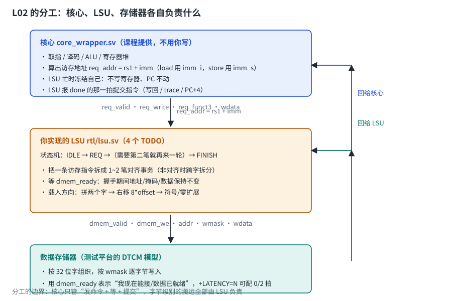
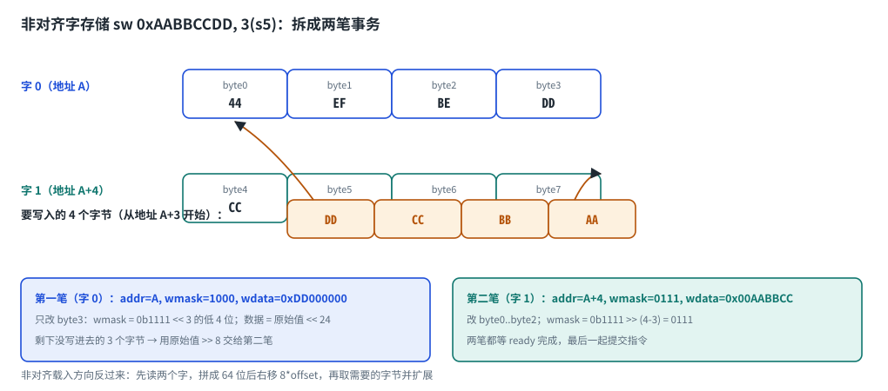
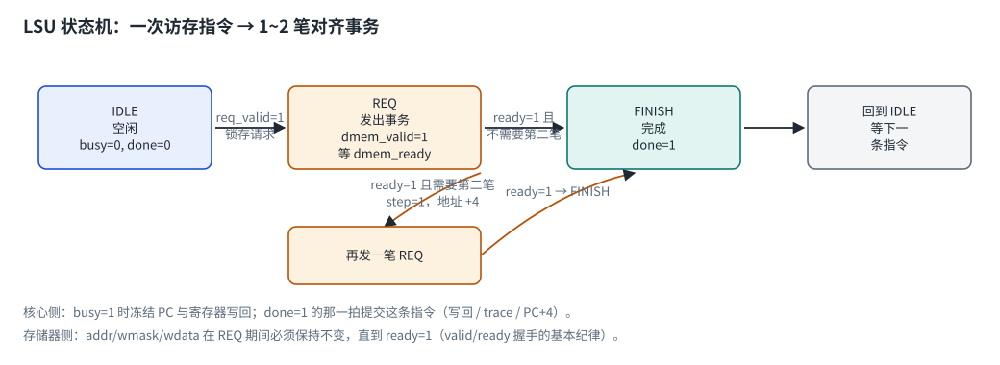

# 第 1 章　为什么把访存独立出来

## 1.1 L01 的做法有什么问题

L01 里，访存逻辑散落在核心内部：`alu_y` 当地址、`wmask` 当掩码、`io_dmem_*` 直接连出去。
对"永远当拍返回、只支持对齐访问"的理想存储器来说，这样做没问题。

但真实存储器有三个特点：

1. **有延迟**：片外 DDR 要几十上百拍，片上 SRAM 也可能要 1~2 拍；
2. **怕非对齐**：存储器按字组织，跨字的访问必须拆开；
3. **可能出错**：越界、权限、总线错误都需要上报（L03 之后的异常处理）。

把这三件事塞进核心，核心会被"时序问题"污染，而且没法复用到流水线版本里。
所以工业界的做法是：**访存独立成一个模块 LSU（Load/Store Unit）**，
核心只发一条"命令"，LSU 负责把它变成若干次总线事务。

上游 CoralNPU 也是这么分的：核心的译码器把访存指令发给 LSU（`Decode.scala` 的 `isLsu()`），
由 LSU 通过 `dbus` 与存储器打交道（见 [doc/microarch/lsu.md](/home/ubuntu/coralnpu/doc/microarch/lsu.md)）。

## 1.2 L02 的分工



一句话概括这条分界线：**核心只管"发一条命令、等它完成、然后提交这条指令"**；
把命令变成 1~2 笔对齐事务、以及读写数据的字节级搬运，全部由 LSU 负责。
这也决定了本课你要写的代码范围——只有 `rtl/lsu.sv` 这一个文件。

# 第 2 章　一次访存事务由什么描述

## 2.1 四个要素

| 要素 | 信号 | 说明 |
| --- | --- | --- |
| 方向 | `dmem_we` | 1 = 写，0 = 读 |
| 地址 | `dmem_addr` | **对齐后的字地址**（低 2 位不要参与寻址） |
| 写掩码 | `dmem_wmask[3:0]` | 每一位对应字内一个字节，1 表示这个字节要改 |
| 数据 | `dmem_wdata[31:0]` | 已按 `addr[1:0]` 左移过的数据，与掩码同一套字节道 |

读方向只有"选择"没有"掩码"：存储器返回整字，由 LSU 自己选字节、扩展。

## 2.2 宽度与掩码

| 指令 | 宽度 | 基掩码 | 对齐要求 |
| --- | --- | --- | --- |
| `lb` / `lbu` / `sb` | 1 字节 | `4'b0001` | 无（任何地址都算"对齐"） |
| `lh` / `lhu` / `sh` | 2 字节 | `4'b0011` | 地址是 2 的倍数 |
| `lw` / `sw` | 4 字节 | `4'b1111` | 地址是 4 的倍数 |

掩码与数据都要按地址低位平移：

```systemverilog
mask0 = base_mask << off;        // off = addr[1:0]
data0 = wdata   << (8 * off);
```

::: {.callout}
**为什么数据也要平移？** 掩码选中的是"字节道"，数据必须出现在同一条道上。
只写掩码不平移数据，写进去的就是 0（或者错误的字节）——这是 L02 最常见的 bug。
:::

# 第 3 章　非对齐访问



## 3.1 为什么难

存储器是"按字访问"的：一次只给你 32 位，或者只改你指定掩码允许的字节。
而 `sw` 到地址 `A+3` 要写 4 个字节：`A+3`、`A+4`、`A+5`、`A+6`。
其中 `A+3` 落在字 0，`A+4..A+6` 落在字 1——**一条指令横跨两个字**。

## 3.2 拆成两笔事务

设 `off = addr[1:0]`，`size` 是访问宽度（1/2/4 字节），则
**需要第二笔事务的条件是 `off + size > 4`**。

| 情形 | off | size | 需要第二笔？ |
| --- | --- | --- | --- |
| `lw` 到 `A+0` | 0 | 4 | 否（`0+4 = 4`） |
| `lw` 到 `A+1` | 1 | 4 | 是（`1+4 = 5 > 4`） |
| `lh` 到 `A+2` | 2 | 2 | 否（`2+2 = 4`） |
| `lh` 到 `A+3` | 3 | 2 | 是（`3+2 = 5 > 4`） |
| `lb` 到 `A+3` | 3 | 1 | 否（`3+1 = 4`） |

两笔事务的参数（对照上图）：

```systemverilog
// 第一笔：字 0
addr0 = {addr[31:2], 2'b00};
mask0 = base_mask << off;                 // 例如 4'b1111 << 3 → 1000（只剩 byte3）
data0 = wdata << (8 * off);               // 对应的字节

// 第二笔：字 1（只在 off + size > 4 时需要）
addr1 = addr0 + 32'd4;
mask1 = base_mask >> (4 - off);           // 例如 4'b1111 >> 1 → 0111
data1 = wdata >> (8 * (4 - off));         // 剩下的字节
```

**写入方向**：两笔都完成（都等到 `ready`）之后，这条指令才算完成。
**读出方向**：第一笔读回的字存进 `word0`，第二笔存进 `word1`，拼成 64 位：

```systemverilog
combined = {word1, word0};                 // 64 位
shifted  = combined >> (8 * off);          // 把目标字节挪到最低位
```

然后按 `funct3` 取 1/2/4 字节并做符号或零扩展。

::: {.callout}
**RISC-V 允许两种实现**：硬件自己拆分（本课的做法），或者触发异常由软件处理
（很多嵌入式核选择后者，因为省面积）。选哪一种要看目标器件——这也是"同一个 ISA、
不同微架构"的又一个例子。
:::

# 第 4 章　存储器延迟与 valid/ready 握手

## 4.1 为什么要握手

如果存储器永远当拍就绪（L01 的模型），LSU 不需要记任何状态：给出地址、当拍拿到数据。
但真实存储器会忙，于是需要一套"我知道你什么时候好"的协议，最常用的就是 **valid/ready**：

* **valid（请求方）**：我要发的这次事务是有效的；
* **ready（接收方）**：我现在能接；
* **`valid && ready` 在同一个时钟沿成立 → 事务完成**。

三条纪律：

1. 发出请求后，**地址、掩码、数据必须保持不变**，直到 `ready` 到来；
2. 请求方不能在等 `ready` 期间撤回或修改请求；
3. 接收方可以在任意时刻拉低 `ready`（表示忙），但不能假装没看见已经成立的握手。

本课的测试平台用 `+LATENCY=N` 模拟忙的周期数：`latency=0` 时 `ready` 恒为 1（与 L01 相同），
`latency=2` 时每个事务要等 2 拍。**你的 LSU 在两种情况下都必须得到相同的结果**——
延迟只影响周期数，不影响架构结果。

## 4.2 上游是怎么描述这件事的

上游 LSU 的 dbus 接口（[doc/microarch/lsu.md](/home/ubuntu/coralnpu/doc/microarch/lsu.md)）：

| 上游信号 | 本课对应 | 说明 |
| --- | --- | --- |
| `dbus.valid` | `dmem_valid` | 事务有效 |
| `dbus.ready` | `dmem_ready` | 事务被接受 |
| `dbus.addr` / `wdata` / `wmask` | 同名 | 上游是 128 位数据 + 16 位掩码 |
| `dbus.size` | 无（由 `funct3` 在 LSU 内决定） | 上游把宽度也发给总线 |
| `dbus.rdata` | `dmem_rdata` | 上游注释写着"**hand-shake 之后一拍到达**" |

注意最后一行：上游的读数据是**握手之后**才回来的（多一拍），所以它的 LSU 必须把它记在槽表里。
本课的模型简化成"握手那一拍数据有效"，但状态机的结构与它是一致的。

# 第 5 章　状态机与"冻结核心"



## 5.1 三个状态

| 状态 | `busy` | `done` | 做什么 |
| --- | --- | --- | --- |
| `IDLE` | 0 | 0 | 等 `req_valid`；锁存请求、算出第一笔事务参数 |
| `REQ` | 1 | 0 | 驱动 `dmem_*` 并等 `dmem_ready`；需要第二笔就再来一轮 |
| `FINISH` | 1 | 1 | 告诉核心"这条指令完成了"，下一拍回 `IDLE` |

## 5.2 核心侧为什么要冻结

核心是单周期的：如果 LSU 要花 3 拍，核心必须在这 3 拍里**保持 PC 不变、不写寄存器、
不产生新的 trace**。本课的 wrapper 用两个信号做到这件事：

```systemverilog
assign mem_op = is_load | is_store;
assign lsu_req_valid = mem_op & ~lsu_busy;          // LSU 忙时不重复发请求
assign commit = mem_op ? lsu_done : 1'b1;           // 访存指令要等 done 才算完成
// 只有 commit=1 时：写寄存器、pc <= next_pc、输出 trace
```

如果忘了冻结，会出现两类典型错误：**同一条指令被提交两次**（trace 行数变多），
或者**PC 提前前进**导致访存请求被下一条指令覆盖（trace 从某一条开始全乱）。

## 5.3 上游的 slot 表：同一个思想的一般化

上游把"一次操作拆成若干待完成条目"这件事做得更彻底：它维护一张**槽表**，
每个条目记录"哪个字节、什么地址、什么数据、是否已完成"，完成一个就翻转 `active` 位，
直到所有条目都完成才写回（见 [doc/microarch/lsu.md](/home/ubuntu/coralnpu/doc/microarch/lsu.md) 的表格）。

本课的"两笔事务 + `step` 标记"是它的最小版本：

| 上游 slot | 本课等价物 |
| --- | --- |
| 一个 slot = 一条 LSU 操作 | 一次 `req_valid` 触发的一轮状态机 |
| slot 表里的每个字节条目 | `mask0` / `mask1` 里的每一位 |
| `active` 位翻转 | `step` 从 0 变成 1、最后进入 `FINISH` |
| 多 slot（未来扩展） | 本课只有一个"在途操作" |

# 第 6 章　自测题

1. `sw` 到地址 `A+3` 时，两笔事务的掩码分别是多少？（`1000` 和 `0111`）
2. `lw` 到 `A+1` 时，第一笔读回的字在 64 位拼接里占哪一半？（低 32 位 `word0`）
3. 为什么数据要左移 `8*off`？（掩码选中的是字节道，数据必须落在同一条道上）
4. `valid=1` 但 `ready=0` 时，LSU 可以修改地址吗？（不可以，必须保持不变）
5. `busy=1` 时核心为什么要冻结 PC？（否则会重复发请求、覆盖在途事务）
6. `done` 应该在哪个状态拉高？为什么只拉高一拍？（`FINISH` 状态；避免同一条指令被提交两次）
7. 上游的槽表和本课的 `step` 是什么关系？（槽表是它的推广：多个字节条目 + active 位）
8. 非对齐访问除了"硬件拆分"，还有什么实现方式？（触发异常交给软件模拟）

# 第 7 章　参考资料

* 本仓库 [doc/microarch/lsu.md](/home/ubuntu/coralnpu/doc/microarch/lsu.md)：上游 LSU 的槽表、
  总线接口与写回时序（**读完本课再回来看，会有完全不同的感受**）
* Patterson & Hennessy《Computer Organization and Design: RISC-V Edition》第 5 章（存储层次）
  <https://www.elsevier.com/books/computer-organization-and-design-risc-v-edition/patterson/978-0-12-820331-6>
* Arm AMBA AXI 规范（工业界最常用的握手与突发传输协议）
  <https://developer.arm.com/documentation/ihi0022/latest/>
* TileLink 规范（RISC-V 生态常用，上游内部交叉开关使用）
  <https://github.com/chipsalliance/tilelink>
* 本仓库 `hdl/chisel/src/coralnpu/scalar/Lsu.scala`：上游 LSU 的实现（做完再看）
