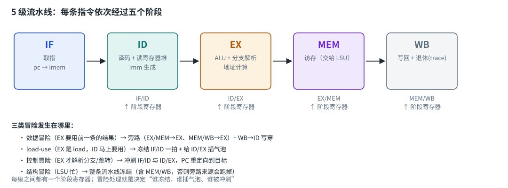
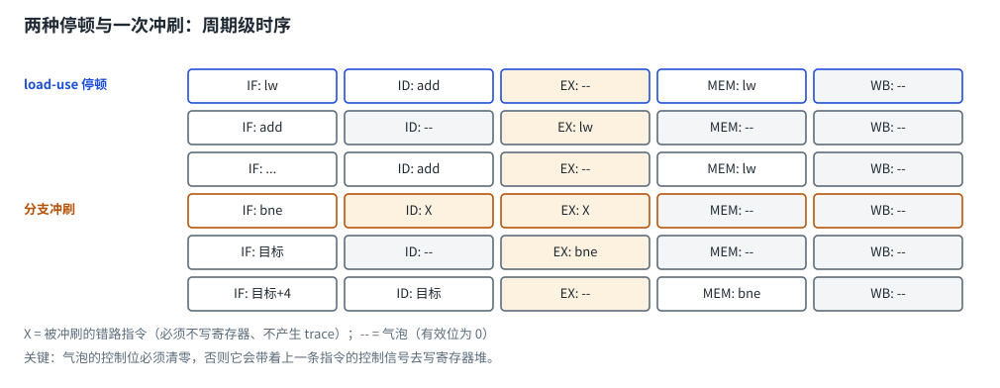

# 第 1 章　为什么要流水线

## 1.1 单周期核的问题

L01/L02 的核是"单周期"的：取指、译码、执行、访存、写回全在一个周期里串成一条长组合逻辑。
它能跑，但有两个硬伤：

1. **主频上不去**：所有事情挤在一拍里，关键路径 = 各级延迟之和；
2. **硬件利用率低**：取指时 ALU 闲着，算的时候取指器闲着。

流水线把这条长链切成 5 段，中间插入**阶段寄存器**：

```text
单周期：  [取指 → 译码 → 执行 → 访存 → 写回]        一拍做完，路径长
流水线：  [IF] | [ID] | [EX] | [MEM] | [WB]          每段一拍，5 条指令同时在飞
```

## 1.2 流水线买的是频率，不是 CPI

这是本课最重要的一句话：

* **频率**：每段逻辑变短 → 时钟周期可以更短 → 主频更高；
* **CPI**（Cycles Per Instruction，每条指令消耗的周期数）：**流水线本身不会改善 CPI**，
  反而因为冒险处理（停顿、冲刷）而变差。

用本课的实测数字说话（参考实现，`latency=0`）：

| 程序 | 指令数 | L02 单周期核周期数 | L03a 流水线周期数 | 流水线 CPI |
| --- | --- | --- | --- | --- |
| 05_c_fib.c | 254 | 568（CPI 2.24） | 676（CPI 2.66） | 2.66 |
| 02_branch.S | 70 | 80（CPI 1.14） | 122（CPI 1.74） | 1.74 |

流水线的 CPI 更差，原因是：每个多周期访存要冻结好几拍、每次分支跳转要冲刷 2 条指令。
**所以真实的处理器要花大力气做分支预测、乱序执行、缓存**——
这些工程努力的目标就是把这部分 CPI 损失补回来，同时保留高主频。

# 第 2 章　五级流水线的结构



## 2.1 每一级做什么

| 阶段 | 做什么 | 阶段寄存器（把结果交给下一级） |
| --- | --- | --- |
| IF | 用 `pc` 取指（组合读指令存储器） | IF/ID：`pc`、`inst`、`valid` |
| ID | 译码、读寄存器堆、生成立即数 | ID/EX：`pc`、`inst`、`rs1_val`、`rs2_val`、`valid` |
| EX | ALU 运算、分支解析、算访存地址 | EX/MEM：`pc`、`inst`、`alu_y`、`rs2_val`、控制位、`valid` |
| MEM | 访存（交给 L02 的 LSU，可能要等好几拍） | MEM/WB：`pc`、`inst`、`data`、`reg_we`、`valid` |
| WB | 写回寄存器堆、输出 trace（退休） | —— |

## 2.2 为什么控制位要跟着指令一起流动

EX 级算出来的 `reg_we`/`is_load`/`is_store` 是**这条指令的属性**，
MEM/WB 级还要用（决定写不写寄存器、要不要等 LSU）。所以它们必须和 `pc`/`inst`
一起被阶段寄存器带下去。

**但要记得和 `valid` 相与**：被冲刷的指令（气泡）里残留的控制位如果不清零，
它照样会在 WB 级写寄存器——这是一个非常隐蔽、非常难查的 bug（本课作业里专门列了这条）。

# 第 3 章　三类冒险与四种处理

## 3.1 数据冒险（RAW）→ 旁路

```asm
addi t0, x0, 5      # 在 EX 算出 5，要到 WB 才写回寄存器堆
add  t1, t0, t0     # 下一条就要用 t0 —— 寄存器堆里还是旧值
```

解法不是等，而是**旁路（forwarding）**：结果在 EX 算出来之后，直接从
EX/MEM 或 MEM/WB 阶段寄存器"抄近路"送回 EX 的输入端。

优先级：**MEM 级比 WB 级更新**，所以先看 MEM，再看 WB。

还有一个容易漏的角落：**WB→ID 的写穿**。寄存器堆在 WB 级写、ID 级读，
两者发生在同一个时钟沿；如果不做处理，ID 读到的是"写之前"的值。
教科书说"前半拍写、后半拍读"，在 RTL 里等价于在 ID 读取时加一次 WB 旁路。

## 3.2 load-use → 插一个气泡

```asm
lw   t1, 0(sp)      # 数据要到 MEM 级结束才有
add  a0, a0, t1     # 紧接着就要用 → 旁路救不了（数据还没出来）
```

必须让后面的指令等一拍：

* 冻结 PC 与 IF/ID（消费指令停在 ID）；
* 给 ID/EX 插一个**气泡**（有效位 0）——否则消费指令会跟着 load 一起进 EX；
* 让 EX/MEM 继续前进（load 进入 MEM 去访存）。

等 load 走出 MEM 进入 WB 时，消费指令正好进入 EX，此时 WB 旁路生效。



## 3.3 控制冒险 → 冲刷

分支/跳转要到 EX 才知道跳不跳，但这时 IF 和 ID 里已经取进了两条"错路"指令。
解法：**冲刷**（把 IF/ID、ID/EX 的有效位置 0）并把 PC 重定向到目标地址。

代价是每次跳转浪费 2 个周期。真实处理器用**分支预测**来减少这笔开销
（猜对了就不用冲刷）——上游 CoralNPU 选择"后向分支预测跳转"，正是这个思路。

## 3.4 结构冒险 → 冻结

L02 的 LSU 处理一次访存要好几拍（IDLE→REQ→FINISH）。这段时间里 MEM 级必须保持不动，
于是**整条流水线冻结**——而且必须连 MEM/WB 一起冻，理由见下一章。

# 第 4 章　为什么"停顿"要分两种

## 4.1 全冻结 vs 插气泡

| 停顿类型 | 冻结谁 | 让谁继续 | 为什么 |
| --- | --- | --- | --- |
| 等 LSU（结构冒险） | 全部（含 MEM/WB） | —— | MEM/WB 里的结果可能还要被 EX 旁路引用 |
| load-use（数据冒险） | PC、IF/ID | ID/EX 插气泡，EX/MEM、MEM/WB 正常前进 | 必须让 load 走掉，否则死锁 |

**如果 load-use 也全部冻结**，EX 里的 load 走不掉，`load_use_stall` 永远为 1 → 死锁。
**如果等 LSU 时不冻结 MEM/WB**，停在 EX 的消费者会失去旁路来源（生产者已经从 WB 溜走了），
只能读到寄存器堆里的旧值 → 结果偶尔错、很难查。

这两条都是本课作者实际踩过的坑，写进作业说明的"常见坑"里了。

# 第 5 章　CPI：怎么量化流水线的效果

```text
CPI = 总周期数 / 退休指令数
```

检查器会直接打印每个程序、每种存储器延迟下的 CPI，例如：

```text
[通过] 05_c_fib.c   lat0: 676 周期/254 条 = CPI 2.66，lat2: 990 周期/254 条 = CPI 3.90
```

怎么用它？

1. **对比不同实现的同一程序**（你的 L02 单周期核 vs 现在的流水线核）；
2. **定位损失来源**：延迟从 0 变到 2，CPI 涨了多少，就是访存停顿的代价；
3. **验证优化**：任何改动只要 CPI 下降、trace 不变，就是真的进步。

这也是"性能分析"的入门：**不要凭感觉说"流水线更快"，要拿数字说话。**

# 第 6 章　与上游 CoralNPU 的对照

| 主题 | 本课（L03a） | 上游 CoralNPU |
| --- | --- | --- |
| 流水级数 | 5 级（IF/ID/EX/MEM/WB，教科书结构） | 4 级：取指 / 译码派发 / 执行 / 写回（[doc/microarch/microarch.md](/home/ubuntu/coralnpu/doc/microarch/microarch.md)） |
| 派发宽度 | 每周期 1 条 | 4 路标量 + 2 路向量（[dispatch.md](/home/ubuntu/coralnpu/doc/microarch/dispatch.md)） |
| 冒险处理 | 旁路 + 停顿 + 冲刷 | 记分板 + 命令队列 + 乱序退休（[RetirementBuffer.scala](/home/ubuntu/coralnpu/hdl/chisel/src/coralnpu/RetirementBuffer.scala)） |
| 分支 | 冲刷 2 条（预测不跳） | 后向分支预测跳转（[doc/overview.md](/home/ubuntu/coralnpu/doc/overview.md)） |
| 访存 | MEM 级冻结等 LSU | LSU 有独立槽表，可与前端并行（[lsu.md](/home/ubuntu/coralnpu/doc/microarch/lsu.md)） |

一句话：**你实现的是"干净、好懂的教科书版本"；上游是工程版本——同样的 ISA，更复杂的微架构。**

# 第 7 章　自测题

1. 流水线提高的是频率还是 CPI？（频率；CPI 往往变差）
2. `addi t0,x0,5` 紧跟 `add t1,t0,t0`，不处理会发生什么？（读到旧值；需要 MEM→EX 旁路）
3. 为什么还需要 WB→ID 的写穿？（寄存器堆写和 ID 读在同一个时钟沿）
4. load 后面紧跟使用结果的指令，为什么旁路不够？（数据要到 MEM 结束才有）
5. 分支冲刷会浪费几条指令？本课为什么是 2 条？（IF 和 ID 各一条）
6. 等 LSU 时为什么连 MEM/WB 都要冻结？（否则旁路来源消失）
7. load-use 停顿为什么不能冻结整条流水线？（load 也走不掉 → 死锁）
8. 气泡的控制位不清零会怎样？（被冲刷的指令照样写寄存器）

# 第 8 章　参考资料

* Patterson & Hennessy《Computer Organization and Design: RISC-V Edition》第 4.5–4.8 节（流水线）
  <https://www.elsevier.com/books/computer-organization-and-design-risc-v-edition/patterson/978-0-12-820331-6>
* Hennessy & Patterson《Computer Architecture: A Quantitative Approach》第 3 章（冒险与 ILP）
  <https://shop.elsevier.com/books/computer-architecture/hennessy/978-0-12-811905-1>
* 本仓库 [doc/microarch/microarch.md](/home/ubuntu/coralnpu/doc/microarch/microarch.md)：上游的流水线与执行单元延迟
* 本仓库 [doc/microarch/dispatch.md](/home/ubuntu/coralnpu/doc/microarch/dispatch.md)：派发规则（做完再看，会很有共鸣）
