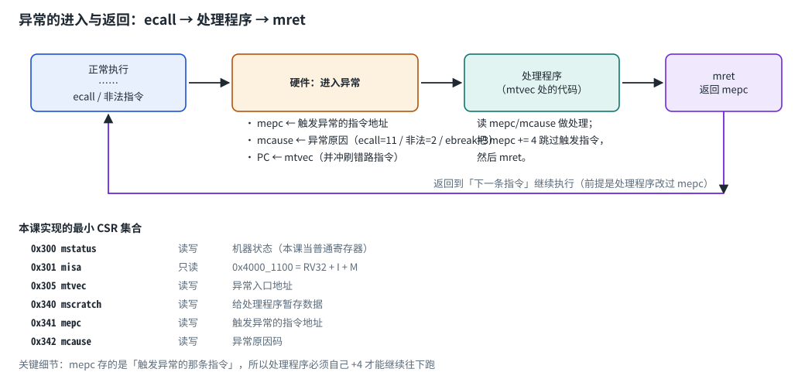

# 第 1 章　M 扩展：乘除法

## 1.1 八条指令

基础 RV32I 只有加减和移位，乘法要自己用移位加法拼。M 扩展补上硬件乘除法：

| funct3 | 指令 | 语义 | 难点 |
| --- | --- | --- | --- |
| 000 | `mul` | 乘积低 32 位 | 有无符号结果相同 |
| 001 | `mulh` | **有符号 × 有符号** 的高 32 位 | 两个操作数都符号扩展 |
| 010 | `mulhsu` | **有符号 × 无符号** 的高 32 位 | 一个符号扩展、一个零扩展 |
| 011 | `mulhu` | **无符号 × 无符号** 的高 32 位 | 都零扩展 |
| 100 | `div` | 有符号除法（向零取整） | 除零、溢出 |
| 101 | `divu` | 无符号除法 | 除零 |
| 110 | `rem` | 有符号取余（符号跟被除数） | 除零、溢出 |
| 111 | `remu` | 无符号取余 | 除零 |

## 1.2 三个必须按规范处理的边界

**① 高位乘法要先扩展再相乘。** Verilog 里 `a * b` 的位宽由上下文决定：

```systemverilog
logic [63:0]        uprod;  assign uprod = a * b;              // 64 位无符号乘积
logic signed [63:0] sprod;  assign sprod = $signed(a) * $signed(b);  // 64 位有符号乘积
```

`mulh` 取 `sprod[63:32]`，`mulhu` 取 `uprod[63:32]`，`mulhsu` 取
`$signed(a) * $signed({1'b0, b})` 的高 32 位。

**② 除零有明确规定**（不能依赖硬件的"未定义行为"）：

* `div` / `divu` 返回全 1（即 -1）；
* `rem` / `remu` 返回**被除数**本身。

**③ 唯一的有符号溢出**：`INT_MIN / -1`。

* `div` 返回 `INT_MIN`（0x8000_0000）；
* `rem` 返回 0。

因为这三种情况都存在，代码里必须**先用 if 挡住**，再去算 `a / b`；
直接写 `y = a / b` 在除零时会得到 X。

## 1.3 组合实现 vs 多周期实现

本课把 MDU 做成**组合电路**（一拍出结果）。真实处理器通常做成多周期流水线除法器
（每拍移位一次，32 拍完成），因为组合除法器的关键路径很长。

练习：上游 CoralNPU 的 `hdl/chisel/src/coralnpu/scalar/Mlu.scala` 与
`doc/microarch/mlu.md` 就是乘法单元的实现与接口说明——对比一下：
它在流水线的哪一级？延迟几拍？（本课的 L02 LSU 就是"多周期执行单元"的现成例子。）

# 第 2 章　CSR 与 Zicsr

## 2.1 什么是 CSR

CSR（Control and Status Register）是**控制状态寄存器**：不属于通用寄存器堆，
用专门的指令访问，用来控制特权级、异常、计数器等。

Zicsr 扩展提供 6 条指令：

| 指令 | 行为 | rd | 说明 |
| --- | --- | --- | --- |
| `csrrw rd, csr, rs1` | 读旧值 → rd；写 rs1 → csr | 总是写 | 交换 |
| `csrrs rd, csr, rs1` | 读旧值 → rd；`csr \|= rs1` | 总是写 | 置位 |
| `csrrc rd, csr, rs1` | 读旧值 → rd；`csr &= ~rs1` | 总是写 | 清位 |
| `csrrwi/csrrsi/csrrci` | 同上，rs1 换成 5 位立即数 | 同上 | 不用读寄存器 |

**一条重要规定**：`csrrs`/`csrrc`（以及立即数形式）在 **rs1 = x0 时不写 CSR**。
为什么？因为有些 CSR 读取会有副作用（例如清中断标志），而 `csrrs rd, csr, x0`
是编译器最常用的"只读"写法。如果它也写，就会产生意外的副作用。

## 2.2 本课实现的最小集合

| 地址 | 名字 | 权限 | 用途 |
| --- | --- | --- | --- |
| 0x300 | `mstatus` | 读写 | 机器模式状态（本课只当普通寄存器用） |
| 0x301 | `misa` | **只读** | 支持的扩展：`0x4000_1100` = RV32 + I + M |
| 0x305 | `mtvec` | 读写 | 异常入口地址 |
| 0x340 | `mscratch` | 读写 | 给异常处理程序暂存数据 |
| 0x341 | `mepc` | 读写 | 触发异常的指令地址 |
| 0x342 | `mcause` | 读写 | 异常原因码 |
| 0x343 | `mtval` | 读写 | 附加信息（本课写 0） |
| 0xF14 | `mhartid` | **只读** | 硬件线程号（0） |

读一个未实现的地址按 0 处理、写它没有效果（本课的简化约定；真实处理器通常会报非法指令）。

## 2.3 CSR 也有数据冒险（本课踩过的坑）

```asm
csrw  mepc, t2      # 在 WB 级才真正写进 CSR
mret                # 下一条就在 EX 级读 mepc —— 读到的是旧值！
```

这和寄存器堆的 RAW 冒险是一回事，处理办法也一样：**EX 级读 CSR 时，
如果 MEM/WB 里有对同一个 CSR 的待提交写，就用它的值**（CSR 旁路）。
本课的核心代码里已经实现了这条旁路（`ex_csr_rdata_f` 那段），你在读代码时可以留意。

# 第 3 章　异常：进入与返回



## 3.1 三个概念

* **异常**（exception）：由指令自己引起（`ecall`、非法指令、访存错误……）；
* **mtvec**：异常处理程序的入口地址；
* **mret**：从异常返回，回到 `mepc`。

## 3.2 完整的流程

```text
   ① 软件在启动时设置 mtvec（异常入口）
        csrw mtvec, t0

   ② 指令触发异常（例如 ecall，mcause = 11）
        硬件做三件事：
          mepc   ← 触发异常的指令地址（本例是 ecall 自己的地址）
          mcause ← 11
          PC     ← mtvec
        同时冲刷异常指令后面的错路指令（和分支冲刷一样）

   ③ 异常处理程序运行，读 mepc/mcause，做该做的事
        csrr t2, mepc
        csrr t3, mcause
        addi t2, t2, 4     ← 关键：跳过触发异常的指令
        csrw mepc, t2

   ④ mret 返回
        PC ← mepc         ← 已经变成"下一条指令"的地址
```

**为什么要 `mepc += 4`？** 因为 `mepc` 存的是*触发异常的指令*的地址。
如果异常处理程序什么都不改就 `mret`，会重新执行那条指令 → 再次异常 → 死循环。
（这正是检查器在异常用例超时时会提示你的那句话。）

## 3.3 常见的 mcause 取值

| 值 | 含义 | 本课会遇到的 |
| --- | --- | --- |
| 2 | 非法指令 | ✓（`.word 0`） |
| 3 | 断点（`ebreak`） | ✓（启动代码的失败路径） |
| 11 | 来自 M 模式的环境调用（`ecall`） | ✓ |

更完整的列表见 RISC-V 特权规范第 3.1.15 节（Trap Cause Codes）。

## 3.4 和上游的关系

上游 CoralNPU 有一整套异常机制：`FaultManager.scala` 收集各执行单元的错误，
`Csr.scala` 维护 CSR，默认的异常处理程序（`toolchain/crt/coralnpu_gloss.cc`）
只是把 `ebreak` 打出来。本课实现的是它的最小子集：

| 本课 | 上游 |
| --- | --- |
| mepc/mcause/mstatus/mtvec | 完整的机器模式 CSR（含中断、计数器、特权级） |
| ecall / 非法指令 | 访存错误、指令错误、总线错误…… |
| 同步异常 | 同步 + 异步（中断、定时器、软件中断） |

# 第 4 章　自测题

1. `mulh` 与 `mulhu` 对同一对操作数为什么可能不同？举例说明。
2. `div x1, x2, x0` 的结果是什么？`rem x1, x2, x0` 呢？
3. `INT_MIN / -1` 的结果是什么？为什么它不算"错误"？
4. 为什么不能直接写 `y = a / b`，而要先用 if 判断除零？
5. `csrrs rd, mstatus, x0` 会修改 mstatus 吗？为什么这么规定？
6. 异常发生后 `mepc` 里是什么？谁负责把它改成"下一条指令"？
7. 为什么 CSR 读写也需要旁路？（提示：`csrw mepc` 紧跟 `mret`）
8. 如果异常处理程序忘了 `csrw mepc`，程序会怎样？（无限触发同一个异常）

# 第 5 章　参考资料

* RISC-V 非特权规范：M 扩展第 7 章、Zicsr 第 9 章 <https://riscv.org/technical/specifications/>
* RISC-V 特权规范：机器模式 CSR 与异常（第 3 章）
* 本仓库 [doc/microarch/mlu.md](/home/ubuntu/coralnpu/doc/microarch/mlu.md)：上游乘法单元的接口与流水
* 本仓库 `hdl/chisel/src/coralnpu/scalar/Csr.scala`、`FaultManager.scala`：上游实现（做完再看）
