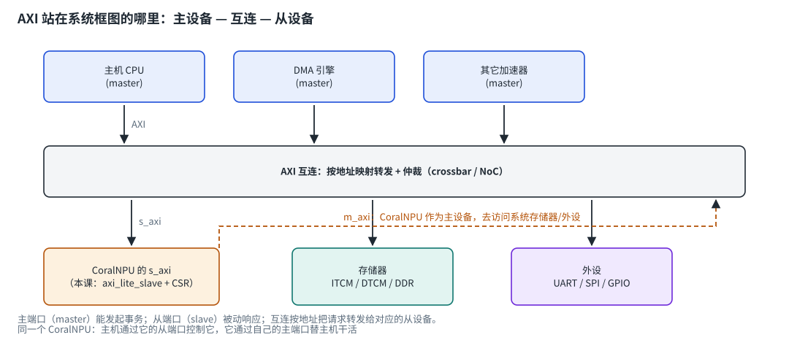
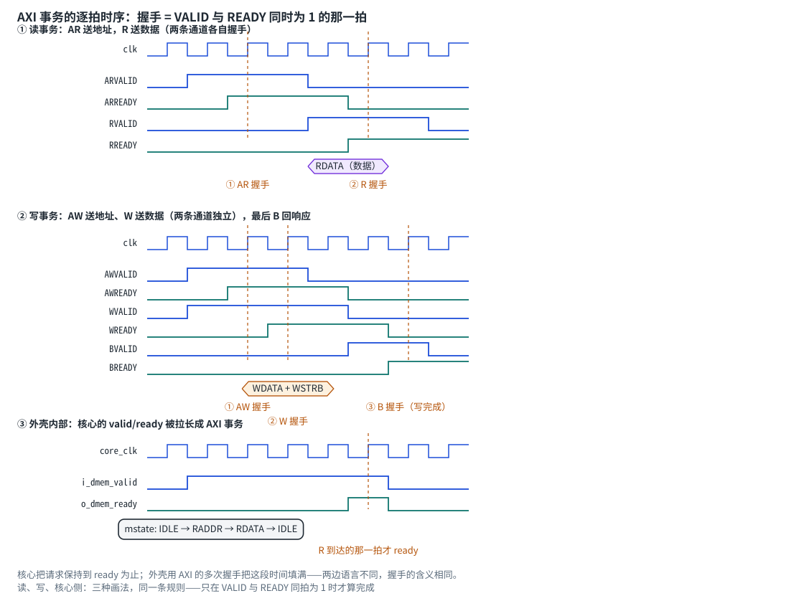
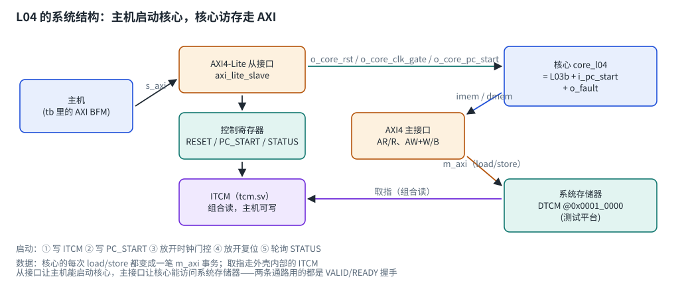

# 第 1 章　为什么要"外壳"

前四课你的核心已经会算数、会访存、会跑异常，但它还只是一个"仿真里的孤岛"：
程序用 `$readmemh` 灌进存储器，复位一放就开始跑，跑完看 trace。

真实的 SoC 不是这样。以 CoralNPU 为例（见 `doc/integration_guide.md`）：

* 它作为**从设备**挂在系统总线上，主机（比如一颗 Cortex-A 核）通过总线给它
  **灌程序、配寄存器、读状态**；
* 它同时是**主设备**：自己的 load/store 变成总线事务，去访问系统里的存储器和外设；
* 启动是**有顺序的**：灌程序 → 写启动地址 → 放开时钟 → 放开复位 → 轮询状态。

把这些事情从核里搬到外面，就是本课的"外壳"。上游对应的实现是
`hdl/chisel/src/coralnpu/CoreAxiCSR.scala`（控制寄存器 + 总线桥）。

| 职责 | 谁负责 | 本课文件 |
| --- | --- | --- |
| 取指/译码/执行/访存 | 核心 | `tests/core_l04.sv`（课程提供） |
| 指令存储器 | 外壳里的 ITCM | `tests/tcm.sv`（课程提供） |
| 主机读写、地址译码、协议握手 | AXI 从接口 | `rtl/axi_lite_slave.sv`（你写） |
| 控制寄存器、启动顺序、核心数据出口 | AXI 外壳 + 主接口 | `rtl/axi_boot_shell.sv`（你写） |

# 第 2 章　AXI 是什么、有什么用、站在系统框图的哪里

## 2.1 先退一步：总线到底解决什么问题

一颗 SoC 里有好几个"能发起访问"的家伙（CPU 核、DMA 引擎、加速器……）和好几个
"会被访问"的东西（存储器、控制寄存器、外设）。如果每对主从之间都拉一根专用线，
连线数量会按"主设备数 × 从设备数"爆炸，而且每加一个 IP 都要改所有人的接口。

于是有了**互连（interconnect）**：所有设备都说同一种"总线语言"，
插到互连上就能互相访问。

```text
专用连线（点对点）             共享互连（总线）
 CPU ────┬──── 内存            CPU ──┐
         ├──── 外设            DMA ──┼── 互连 ──┬── 内存
 DMA ────┴──── 内存                  加速器 ──┘        ├── 外设
 连线数 = 主 × 从                                       └── 加速器
                               连线数 ≈ 主 + 从，且接口统一
```

互连要解决四件事，它们决定了总线协议的形态：

1. **寻址**：每个从设备占据一段地址（地址映射 / address map），互连按地址转发，
   没人认领的地址要能报错（这就是本课的 `SLVERR`）；
2. **仲裁**：多个主设备同时要用同一条通路时排队；
3. **数据搬运**：地址、数据、写掩码怎么传；
4. **流控**：接收方来不及时怎么"踩刹车"（握手机制）。

## 2.2 AXI 是什么

**AXI = Advanced eXtensible Interface**，是 ARM 的 **AMBA**（Advanced
Microcontroller Bus Architecture）家族里的一档总线协议。理解它要抓住三点：

**① 它是"协议"，不是器件，也不是一段代码。**
AXI 规定的是一组信号在时钟上如何跳变、何时算作一次传输；具体是谁、怎么实现
（Chisel 写的、Verilog 写的、第三方 IP）都无所谓。这就是它能被到处复用的原因：
**同一套协议，让不同厂商的 IP 可以拼在一起**。

**② 它有版本和档位，不是一件事。**

| 名字 | 特点 | 典型用途 |
| --- | --- | --- |
| AXI3 | 老版本，突发最多 16 拍 | 历史遗留 |
| AXI4 | 突发最多 256 拍、支持乱序 ID、QoS 等 | 高性能主设备（CPU、DMA、加速器） |
| AXI4-Lite | AXI4 的**单拍子集**：无突发、无 ID、固定数据宽度 | 控制寄存器、低速外设 |
| AMBA 5 / ACE | 带缓存一致性的扩展 | 多核 CPU 一致性总线 |

（顺带认识一下同家族的其他成员：**APB** 是最简单的低速外设总线，
**AHB** 是 AXI 之前的一代。RISC-V 世界里还有一个对标的协议叫 **TileLink**，
本仓库上游的 CoralNPU 同时提供 AXI 和 TileLink 两种外壳，你在 L08 会见到 TileLink。）

**③ 它"又快又解耦"，代价是信号多、规矩严。**
相比最简单的 SRAM 接口（地址进去、数据当拍出来），AXI 有两个本质区别：

* **通道分离**：读和写各有自己的地址/数据通道，可以同时进行；
* **地址与数据解耦**：主设备可以先发一串地址再送数据，从设备也可以"收到请求后
  慢慢给数据"（靠 `VALID/READY` 握手），还能有多个未完成事务（outstanding）
  同时在飞。

这几个设计一起解释了"AXI 为什么能跑得高"：长延迟、多主设备、突发搬运都能被掩盖，
代价是接口信号多、协议状态机复杂——所以低速外设宁愿用简单的 APB。

## 2.3 它在系统框图的什么位置

AXI 出现在**主设备和从设备之间的那条连线**上，中间通常还有一个互连：



框图上每个设备都挂在"端口"上：

* **主端口（master port）**：能发起事务的一侧（CPU、DMA、加速器）；
* **从端口（slave port）**：被动响应的一侧（存储器、外设、控制寄存器）；
* **互连**：把 N 个主端口和 M 个从端口接起来，按地址转发、仲裁冲突。

### CoralNPU 的"双重身份"

框图上最值得注意的是 CoralNPU 自己：**它同时是主设备，又是从设备**
（本课的外壳就是这个十字路口）：

| 端口 | 谁在用 | 干什么 | 本课对应 |
| --- | --- | --- | --- |
| `s_axi`（从） | 系统里的主机 CPU | 灌程序、配寄存器、读状态 | `axi_lite_slave.sv` + 三个 CSR |
| `m_axi`（主） | CoralNPU 自己 | 用自己的身份去读写系统存储器/外设 | `axi_boot_shell.sv` 里的主状态机 |

这也解释了为什么上游文档把 CoralNPU 描述成"a CoralNPU configuration that can
integrate with an AXI based system"——它不是一个孤立的核，而是系统里的一块**外设
兼加速器**：主机通过从端口控制它，它通过主端口替主机干活。

## 2.4 五条通道

AXI 把"一次读写"拆成五条**独立**的通道，每条通道自己握手：

| 通道 | 方向（对主设备而言） | 内容 |
| --- | --- | --- |
| AW（write address） | 主 → 从 | 写地址 |
| W（write data） | 主 → 从 | 写数据 + 字节掩码 `WSTRB` |
| B（write response） | 从 → 主 | 写响应码 |
| AR（read address） | 主 → 从 | 读地址 |
| R（read data） | 从 → 主 | 读数据 + 读响应码 |

为什么拆这么细？因为**地址和数据可以分开走**：主设备可以先把地址发出去，
数据晚几拍再跟上；从设备也可以先收地址、等内部准备好再收数据。

## 2.5 三条握手规则（背下来）

1. **握手 = VALID 与 READY 同一拍为 1**。少了任何一个都不算发生。
2. **VALID 不能等 READY**：主设备拉高 `AWVALID` 后，必须一直保持到 `AWREADY` 为 1
   才能撤（数据也必须保持不变）。反过来，从设备**可以**等 VALID 再拉 READY。
3. **响应不能被"吃掉"**：`BVALID`/`RVALID` 拉起之后要一直保持，
   直到主设备用 `BREADY`/`RREADY` 接走。

第 2 条写错会直接卡死：主设备因为 `READY=0` 撤回 VALID、从设备又以为"没来过"，
两边永远对不上。本课测试平台里的主机 BFM（`tests/tb_axi.sv` 的 `host_write`/`host_read`）
就是按这条规则写的，你可以对照看。

### 逐拍看一遍



三条面板从上到下分别是：**读事务**（AR 送地址、R 送数据）、**写事务**
（AW 与 W 各自独立握手、B 回响应）、**外壳内部**（核心的 `valid/ready` 如何被"拉长"
成一次 AXI 事务）。看的时候盯住三件事：

1. **握手只发生在虚线那一刻**（VALID 与 READY 同拍为 1 的那个时钟沿）；
2. **VALID 先来、READY 后到也没关系**，只要 VALID 一直保持（面板 1 的 ARVALID）；
3. AW 和 W 可以不同拍握手（面板 2 的 ① 和 ②），从设备必须两路都收齐才能落盘。

## 2.6 从接口：地址译码与响应码

从接口要做两件事：

**① 地址译码**——判断这次访问落在哪个设备上：

| 地址 | 设备 | 谁处理 |
| --- | --- | --- |
| `0x0000_0000 – 0x0000_1FFF` | ITCM | 写进 `tcm.sv`；读回 ITCM 内容 |
| `0x0003_0000 + 0x0/0x4/0x8` | 控制寄存器 | `RESET_CONTROL` / `PC_START` / `STATUS` |
| 其它 | 无设备 | 返回 `SLVERR` |

**② 响应码**——告诉主机这次访问的结果：

| 码 | 名字 | 含义 |
| --- | --- | --- |
| `2'b00` | OKAY | 正常完成 |
| `2'b01` | EXOKAY | 独占访问成功（本课不用） |
| `2'b10` | SLVERR | 从设备收到了，但处理出错（例如地址没有对应设备） |
| `2'b11` | DECERR | 互连没有找到能响应的从设备（本课用 SLVERR 代替） |

本课测试平台会故意读一个未映射地址（`0x30020`），要求你返回 `SLVERR` ——
"悄悄返回 0" 在真实系统里是最危险的行为：软件分不清"这个寄存器是 0"还是"根本没有这个寄存器"。

## 2.7 主接口：把核心的 `valid/ready` 翻译成 AXI

核心的数据端口是 L02 定的约定：

* 核心把 `addr/wdata/wmask/we` 和 `valid=1` 保持住，直到 `ready=1`；
* **读的时候**，`ready=1` 那一拍 `rdata` 必须同时有效（核心当拍采样）。

AXI 的一次读要经过 AR 握手 + R 握手（至少两拍），所以外壳要把它"拉长"：

```text
核心: valid=1 保持 ────────────────────────────────────────┐
外壳: IDLE → RADDR(AR 握手) → RDATA(等 R) → 完成           │
核心: ready=1（就在 R 到达的那一拍） ←──────────────────────┘
```

写成一行就是：

```systemverilog
assign o_dmem_ready = i_dmem_we ? ((mstate == M_BRESP) && m_bvalid)      // 写：B 到达
                                : ((mstate == M_RDATA) && m_rvalid);     // 读：R 到达
assign o_dmem_rdata = d_hit_itcm ? itcm_drdata : m_rdata;                // 读数据同拍给出
```

**为什么 ITCM 命中的访问不总线？** 因为核心的取指端口是**组合读**——
它给出地址的那一拍就要拿到指令，没有停顿信号。所以 ITCM 必须放在外壳内部、
用组合读实现（`tests/tcm.sv`）；而 DTCM 在测试平台里（当作系统存储器），
核心的每一次 load/store 都要真的走一遍 AXI 主接口，这样本课的重点才练得到。

## 2.8 本课为什么只用 AXI4-Lite 子集

完整的 AXI4 有突发、乱序 ID、QoS、缓存属性一大堆东西；本课的核心每次访问正好
只有一个数据拍，所以：

* **主机侧**用 AXI4-Lite（没有 burst、没有 ID，握手规则和 AXI4 完全一样）；
* **核心侧**沿用 AXI4 的通道名，但每个事务也只发一个数据拍
  （相当于 `len=0` 的突发）。

学完这一课再看完整 AXI4 规范，你会发现"多出来的部分"几乎都是同一套握手规则的组合：
突发 = 一拍地址后面跟着多拍数据（用 `LAST` 标出最后一拍）；乱序 = 给事务编号（`ID`），
让响应按 ID 回来而不是按顺序回来。

上游 CoralNPU 的 AXI 主接口约定（值得一读）：`prot` 恒为 2、`id` 恒为 0、
`burst` 恒为 INCR、`cache` 恒为 0（Device non-bufferable）。

## 2.9 术语表（读上游文档时对照）

| 词 | 含义 | 本课哪里出现 |
| --- | --- | --- |
| transaction（事务） | 一次完整的读或写 | 一次 load / store |
| beat（数据拍） | 事务里的一次数据传输 | 本课都是一拍 |
| burst（突发） | 一次地址 + 多拍数据 | 本课不用（AXI4-Lite） |
| outstanding | 已发出、尚未收到响应的事务数 | 本课是 1（做完再发下一笔） |
| master / slave | 发起方 / 响应方 | `m_axi` / `s_axi` |
| interconnect | 把主从接起来的交换网络 | 系统框图中的中间那块 |
| OKAY / SLVERR / DECERR | 响应码 | 未映射地址回 `SLVERR` |

# 第 3 章　启动流程

## 3.1 三个控制寄存器

它们**不是** RISC-V 的 CSR（不通过 `csrrw` 访问），而是**内存映射寄存器**，
主机用普通的总线写来访问——对比一下 L03b 第 2 章：

| 偏移 | 名字 | 位 | 含义 | 复位值 |
| --- | --- | --- | --- | --- |
| `0x0` | `RESET_CONTROL` | bit0 `RESET` | 1 = 核心保持在复位 | 1 |
| | | bit1 `CLOCK_GATE` | 1 = 核心时钟门控打开（核心没有时钟） | 1 |
| `0x4` | `PC_START` | 31:0 | 核心复位后从哪个地址开始取指 | 0 |
| `0x8` | `STATUS`（只读） | bit0 `HALTED` | 核心执行了 `mpause` 停机 | 0 |
| | | bit1 `FAULT` | 核心进入异常但 `mtvec` 还是 0（跑飞了） | 0 |

## 3.2 五步启动流程

上游 `doc/integration_guide.md` 的流程，本课一字不改地照搬：

```text
① 把程序写进 ITCM         主机用 s_axi 逐个字写 0x0000_0000 起
② 写 PC_START             写 0x0003_0004 = 程序入口（本课是 0x100）
③ 释放时钟门控            写 RESET_CONTROL = 0x1（RESET 仍为 1）
④ 释放复位                写 RESET_CONTROL = 0x0
⑤ 轮询 STATUS             读到 HALTED=1（正常停机）或 FAULT=1（跑飞）
```

## 3.3 为什么必须"先放开时钟、再放开复位"

这是本课最容易踩的坑，也是上游文档专门写了一段的原因（"Reset Considerations"）：

* 核心的复位是**同步**的：它要在时钟上升沿采样 `rst`；
* 上电时核心同时处于"复位 + 时钟门控"状态，**没有时钟沿**；
* 如果你先放开复位、后放开时钟，那么第一个时钟沿到来时 `rst` 已经是 0 ——
  核心从来没有见过"复位有效"，寄存器停在未初始化状态（仿真里就是 X）。

顺序反过来（先放时钟、此时 `rst` 仍为 1）才能让核心先复位、再启动。
第 3.2 节第 3、4 步的顺序不是随意的，测试平台就是照这个顺序写的。

## 3.4 本课的系统结构



```text
   主机（tb_axi.sv 里的 BFM）                系统存储器（tb 里）
        │  s_axi (AXI4-Lite)                     │  m_axi (AXI4 单拍)
        ▼                                        ▲
   ┌────────────────────────── 外壳 axi_boot_shell ──────────────────────────┐
   │  axi_lite_slave ── 译码 ──► ITCM（tcm.sv，主机可写、核心只读）           │
   │        │                └► RESET_CONTROL / PC_START / STATUS            │
   │        └► 启动控制：o_core_rst / o_core_clk_gate / o_core_pc_start      │
   │  AXI 主状态机：核心的 load/store → AR/R、AW+W/B                          │
   └─────────────────────────────────────────────────────────────────────────┘
        │ imem（组合读）      │ dmem（valid/ready）
        ▼                     ▼
   核心 core_l04（L03b 的核 + i_pc_start + o_fault）
```

内存映射（与上游一致，做了裁剪）：

| 区域 | 地址 | 说明 |
| --- | --- | --- |
| ITCM | `0x0000_0000 – 0x0000_1FFF` | 8 KB，指令与只读数据；主机可写，核心只读 |
| DTCM | `0x0001_0000 – 0x0001_7FFF` | 32 KB，栈/全局变量；**本课放在总线的另一侧**，每次访问都是一笔 AXI 事务 |
| CSR | `0x0003_0000` 起 3 个字 | 控制与状态寄存器 |

# 第 4 章　从协议到代码：信号名、端口与骨架 TODO 的对照

前面三章讲的是"为什么"和"画在图上长什么样"，这一章把它们落到你手里的两个文件：
**每个概念在骨架里叫什么名字、写在哪个 TODO、检查器怎么验收**。

## 4.1 AXI 信号 ↔ 骨架端口名

命名规律很简单：**`s_` 开头 = 从接口（slave，主机连过来），`m_` 开头 = 主接口
（master，核心连出去）**。信号名就是"通道 + 字段 + valid/ready"：

| AXI 通道 | 通道字段 | 从接口（`axi_lite_slave.sv`） | 主接口（`axi_boot_shell.sv` 里） |
| --- | --- | --- | --- |
| AW 写地址 | addr / valid / ready | `s_awaddr` / `s_awvalid` / `s_awready` | `m_awaddr` / `m_awvalid` / `m_awready` |
| W 写数据 | data / strb / valid / ready | `s_wdata` / `s_wstrb` / `s_wvalid` / `s_wready` | `m_wdata` / `m_wstrb` / `m_wvalid` / `m_wready` |
| B 写响应 | resp / valid / ready | `s_bresp` / `s_bvalid` / `s_bready` | `m_bresp` / `m_bvalid` / `m_bready` |
| AR 读地址 | addr / valid / ready | `s_araddr` / `s_arvalid` / `s_arready` | `m_araddr` / `m_arvalid` / `m_arready` |
| R 读数据 | data / resp / valid / ready | `s_rdata` / `s_rresp` / `s_rvalid` / `s_rready` | `m_rdata` / `m_rresp` / `m_rvalid` / `m_rready` |

注意本课的主接口**没有** `len`/`size`/`burst`/`id` 这些信号：每个事务只有一个数据拍，
一个 32 位字，所以"地址 + 数据 + 掩码"就够了（这就是 2.8 节说的 Lite 子集）。

## 4.2 从接口为什么要多一个"本地端口"

从接口不直接连存储器，而是先翻译成一组**本地信号**，再由外壳做地址译码：

| 本地信号 | 方向 | 含义 | 为什么这样设计 |
| --- | --- | --- | --- |
| `o_wr_en` | 输出 | **单拍脉冲**：这一拍发生写入 | AXI 握手完成后，落盘只需一拍；用脉冲表示"就是现在" |
| `o_wr_addr` / `o_wr_data` / `o_wr_strb` | 输出 | 写地址 / 数据 / 字节掩码 | 对应 AW 和 W 通道里捕获到的内容 |
| `i_wr_resp` | 输入 | 写响应码 | 由外壳判断（命中 ITCM/CSR = OKAY，否则 SLVERR） |
| `o_rd_addr` | 输出 | 读地址，**握手后保持不变** | 本地读是组合逻辑，地址一变数据就变，必须稳住 |
| `i_rd_data` / `i_rd_resp` | 输入 | 组合读出的数据与响应码 | 省掉一套读握手，外壳只要给个组合 mux |

所以从接口的活儿就是：**五条 AXI 通道 ↔ 一组本地读写信号**。

## 4.3 每个 TODO 对应哪一节、哪条验收

| 文件 / TODO | 概念在 | 写完后检查器会看 |
| --- | --- | --- |
| `axi_lite_slave.sv` TODO 1（AW/W 捕获） | 2.4、2.5、2.6 | `HOST step1_words=… resp=0`（ITCM 写成功） |
| TODO 2（`o_wr_en` + B 响应） | 2.5、2.6 | 同上；`itcm_write_err` 不出现 |
| TODO 3（AR 握手、地址保持） | 2.5、2.7 | `HOST step2_pc_start=…`（读回 PC_START） |
| TODO 4（R 响应） | 2.5、2.7 | `HOST step4_reset_control=…`、`STATUS` 轮询成功 |
| TODO 5（时序更新） | 2.5 | 上面几条都会用上它 |
| `axi_boot_shell.sv` TODO 1（译码与响应码） | 2.6 | `HOST probe_unmapped=… resp=2`（SLVERR） |
| TODO 2（例化 ITCM） | 2.6、3.4 | `HOST step1_words` 里的读回值等于指令 |
| TODO 3（CSR 读） | 3.1 | `step2` / `step3` / `step4` 的读回值 |
| TODO 4（CSR 写 + 启动控制） | 3.1、3.2、3.3 | `step3=0x1`、`step4=0x0`；核心从 PC_START 开始跑 |
| TODO 5（取指/数据路由） | 2.7、3.4 | trace 与黄金模型逐条一致（取指读 ITCM） |
| TODO 6（AXI 主状态机） | 2.7、3.4 | DTCM 全量一致 + `HOST axi_txns rd≥1 wr≥1` |

## 4.4 逐拍推演：主机写 `PC_START = 0x100`

把 5 步流程里的第 2 步拆开，看信号怎么动（对应 `tests/tb_axi.sv` 的 `host_write`）：

| 拍 | 主机（BFM） | 从接口 | 外壳 | 结果 |
| --- | --- | --- | --- | --- |
| T0 | 拉高 `s_awvalid`、`s_wvalid`，给出 `0x30004` 和 `0x100` | `s_awready/s_wready` 本来就有空 → 同拍握手 | — | 地址、数据被捕获进 `aw_addr_q`/`w_data_q` |
| T1 | 等 B 响应 | `o_wr_en=1`（AW、W 都到齐） | `wr_hit_csr=1` → `pc_start_q <= 0x100` | 寄存器落盘 |
| T2 | — | `s_bvalid=1`，`s_bresp=OKAY` | — | 主机看到响应，写完成 |
| T3 | 主机读回 `0x30004` | AR 握手 → `o_rd_addr=0x30004` | `csr_rdata = pc_start_q` | 读回 `0x100`，与写入一致 |

这也是为什么 `STATUS` 只用 `i_core_halted`/`i_core_fault` 两个输入：CSR 是"外壳的状态
窗口"，核心只管把状态交出来，怎么给主机看由外壳决定。

## 4.5 逐拍推演：核心一次 load（未命中 ITCM）

| 拍 | 核心 `core_l04` | 外壳 | 系统存储器（tb） |
| --- | --- | --- | --- |
| T0 | `i_dmem_valid=1`，地址 `0x0001_0000` | 判定未命中 ITCM → `mstate: IDLE → RADDR` | — |
| T1 | 保持 valid（核心不知道总线上发生了什么） | `m_arvalid=1`，AR 握手 | `m_arready=1` → 收下地址 |
| T2 | 继续保持 | `mstate=RDATA`，`m_rready=1` | 按 `+LATENCY` 延迟后给出 `m_rvalid` |
| T3 | **`o_dmem_ready=1`，同时采样 `o_dmem_rdata`** | `o_dmem_ready = (mstate==RDATA)&&m_rvalid` | `R` 通道数据有效 |

核心侧的"一拍完成"和 AXI 侧的"多拍握手"就是这样接起来的；
命中 ITCM 时这一整列被压成一拍（`o_dmem_ready=1` 组合给出）。

## 4.6 读代码地图

| 你想确认的事 | 看哪里 |
| --- | --- |
| 接口到底有哪些端口、每拍怎么变 | `rtl/axi_lite_slave.sv`、`rtl/axi_boot_shell.sv` 的端口列表 |
| 检查器怎么判定通过 | `tests/checks.py` 的 `boot_flow_problems()`（启动流程断言）与 trace 对拍 |
| 主机 5 步具体怎么写 | `tests/tb_axi.sv` 的 `host_write` / `host_read` / 主流程 initial 块 |
| 系统存储器长什么样 | 同文件的 `in_dtcm`、`memstate` 状态机（含 `+LATENCY` 延迟模型） |
| 核心侧接口的原始约定 | L02 基础知识「握手」一节 + `tests/tb_cpu.sv` |
| 每个 TODO 的参考写法 | `./learn hint L04 1` … `5`，或做完后看 `refs/` |

# 第 5 章　与上游对照

| 本课 | 上游 CoralNPU |
| --- | --- |
| `axi_lite_slave.sv` | AXI 桥（把 AXI4 事务拆成内部读写） |
| `axi_boot_shell.sv` | `CoreAxiCSR.scala`（CSR 映射 + reset/cg/pcStart/status） |
| `RESET_CONTROL` / `PC_START` / `STATUS` | 同名寄存器，见 `doc/integration_guide.md` |
| `tcm.sv`（ITCM） | 上游的 TCM + 主机访问端口 |
| 5 步启动 | `doc/integration_guide.md` 的 "Booting CoralNPU" |

几处刻意的简化，读上游代码时注意区分：

* 上游 `s_axi` 除了 CSR，还能读写 TCM；本课主机只写 ITCM + 读写 CSR；
* 上游 `m_axi` 支持完整 AXI4（ID/突发/prot 等）；本课每个事务只有一个数据拍；
* 上游的 `CLOCK_GATE` 由顶层的时钟门控单元消费；本课直接在测试平台里做
  `core_clk = clk & ~gate`；
* 上游的 fault 来自 `FaultManager`（总线错误、非法指令、断言等汇总）；
  本课简化为"异常 + `mtvec=0`"以及总线上出现非 OKAY 响应。

# 第 6 章　自测题

1. AXI 是"一个器件"还是"一套协议"？为什么说它是 IP 复用的关键？
2. 在系统框图上，主端口和从端口分别在哪一侧？互连靠什么决定把请求转发给谁？
3. CoralNPU 为什么"既是主设备又是从设备"？`s_axi` 和 `m_axi` 各自服务谁？
4. AXI 为什么要把读和写拆成独立通道、把地址和数据解耦？（对比最简单的 SRAM 接口）
5. `AWVALID` 拉高后 `AWREADY` 一直不来，主设备能不能撤回 `AWVALID`？为什么？
6. 从设备把 `BVALID` 做成"一拍脉冲"会出什么问题？（提示：主设备还没准备好接）
7. 主机读 `0x30020` 时，你的外壳应该返回什么？如果返回 0 会误导软件什么？
8. 为什么 AXI 主接口上的 `o_dmem_ready` 要在 R/B 到达的那一拍才拉高？
9. 核心取指为什么不能走 AXI 主接口？（提示：核心的 imem 端口是组合读）
10. 5 步启动流程里，如果第 3、4 步调换顺序会发生什么？
11. `STATUS.FAULT` 在这套设计里可能由哪两个原因置起？
12. 为什么 ITCM 的读要用 `always_comb` 而不是"连续赋值 + 读数组的函数"？
13. 骨架里的 `s_awready` 与 `m_awready` 分别属于哪个端口、面向谁？
    为什么同一个协议要写两套信号名？
14. 从接口为什么要把 AXI 翻译成"`o_wr_en` 单拍脉冲 + 组合读"这组本地信号，
    而不是直接连存储器？

# 第 7 章　参考资料

* 本仓库 [`doc/integration_guide.md`](../../../doc/integration_guide.md)：CoralNPU 的
  AXI 接口说明、内存映射、**5 步启动流程**与三个控制寄存器的位定义
* 本仓库 [`hdl/chisel/src/coralnpu/CoreAxiCSR.scala`](../../../hdl/chisel/src/coralnpu/CoreAxiCSR.scala)：
  上游实现（`resetReg` 的初值 3、`pcStartReg` 的捕获、`statusReg` 的组装）
* ARM AMBA AXI 规范（AXI4 / AXI4-Lite 的手续与 VALID/READY 规则）
* CS:APP（第 3 版）第 6 章「存储器层次结构」：6.1–6.3 讲清楚"总线/存储器怎么协作"，
  6.4/6.5 的缓存与写策略能解释为什么 `WSTRB` 这样的字节掩码会出现在总线上
