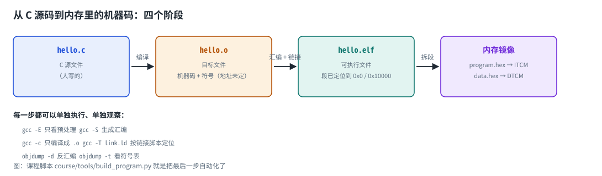
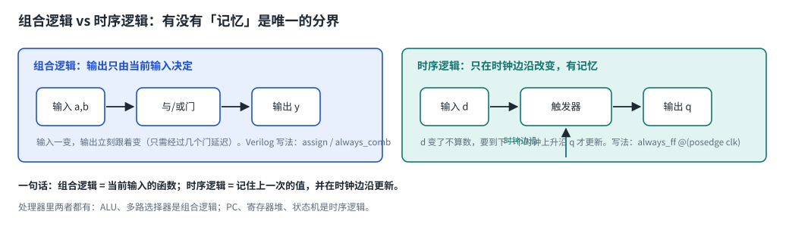
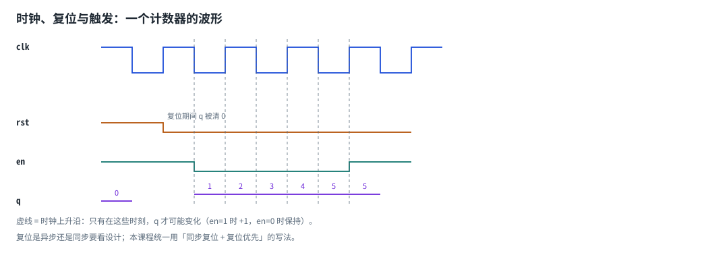
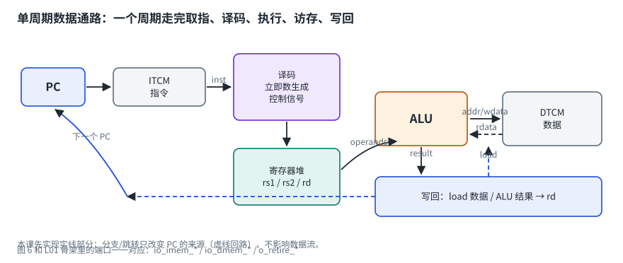

# 这门预备课是给谁的

如果你打开 L00 的《作业说明》，看到「交叉编译」「ELF」「RTL」「组合逻辑」「寄存器」这些词
心里没底，这门课就是为你写的。它不讲 NPU，只补五件事：

1. **命令行**——把命令敲对、把输出存下来、看懂报错；
2. **从 C 到机器码**——源码是怎么变成内存里的一串 0/1 的；
3. **数字逻辑**——电路里「组合」「时序」「时钟」「复位」到底指什么；
4. **Verilog 语法**——写出第一个能跑的硬件模块；
5. **RISC-V**——一条指令在处理器里怎么被执行。

学完的标准很简单：**你能独立读懂 L00 和 L01 的作业说明，并知道每条命令在干什么。**
如果某一层你已经会了，跳过对应的模块即可（`./learn diag` 会告诉你跳哪几层）。

# 第 1 章　命令行与文件系统

## 1.1 你现在在哪

打开终端后，你总是处在某个**目录**里。先确认位置：

```bash
pwd
```

本课程所有命令都约定在**仓库根目录**执行（也就是包含 `README.md`、`course/`、`hdl/` 的那个目录）。
如果你不确定自己在哪，先 `cd` 过去：

```bash
cd ~/coralnpu    # 换成你自己的路径
pwd              # 应该以 coralnpu 结尾
```

## 1.2 最常用的几条命令

| 命令 | 作用 | 例子 |
| --- | --- | --- |
| `pwd` | 显示当前目录 | `pwd` |
| `ls` | 列出目录内容 | `ls course/lessons` |
| `cd` | 切换目录 | `cd course`、`cd ..` 回上一级 |
| `mkdir -p` | 建目录（上级不存在也一起建） | `mkdir -p course/work/P0` |
| `cat` | 打印文件内容 | `cat course/README.md` |
| `head -20` | 只看前 20 行 | `head -20 file.txt` |
| `grep 关键词` | 在输出里找行 | `grep main symbols.txt` |
| `rm` | 删除文件（不可恢复，慎用） | 本课程几乎用不到 |

路径有两种写法：

* **绝对路径**：从根目录开始，例如 `/home/ubuntu/coralnpu/course`；
* **相对路径**：从当前目录开始，例如 `course/lessons`；`.` 表示当前目录，`..` 表示上一级。

## 1.3 把输出存进文件（作业里反复用到）

```bash
pwd > out.txt          # > 表示「覆盖写入」
echo hello >> out.txt  # >> 表示「追加」
ls course >> out.txt
cat out.txt            # 看结果
```

管道 `|` 则是把前一条命令的输出直接交给后一条命令：

```bash
riscv64-unknown-elf-objdump -d a.elf | head -20
```

## 1.4 退出码：脚本判断成功与否的依据

每条命令结束都会返回一个数字（退出码），`0` 表示成功，非 0 表示失败。

```bash
true;  echo $?    # 0
false; echo $?    # 1
```

`$?` 是「上一条命令的退出码」。你跑 `./learn check` 时，最后返回 0 还是 1，就是「通过」与「失败」的区别。

## 1.5 报错怎么读

| 报错 | 含义 | 怎么办 |
| --- | --- | --- |
| `command not found` | 系统找不到这个命令 | 拼错了，或者没装（`./learn doctor --install`） |
| `No such file or directory` | 文件/目录不存在 | 用 `ls` 确认路径；相对路径是相对当前目录的 |
| `Permission denied` | 没有权限 | 安装软件用 `sudo`；脚本要有可执行权限 |
| 一屏红字但程序还在跑 | 多半是警告 | 先找 `Error`，再看第一行报错 |

## 1.6 本课约定

* 命令都在仓库根目录执行；
* 你的产物统一放在 `course/work/` 下（这个目录被 git 忽略，随便折腾）；
* 遇到报错先把完整信息 `cat` 出来看，不要只看最后一行。

# 第 2 章　从 C 源码到机器码

## 2.1 四个阶段



编译一个程序不是一步完成的，而是四步。以课程里的 `hello.c` 为例，每一步都可以单独执行、单独观察：

| 阶段 | 命令 | 产物 | 产物里有什么 |
| --- | --- | --- | --- |
| 预处理 | `gcc -E hello.c -o hello.i` | `.i` | 展开 `#include` 与宏 |
| 编译 | `gcc -S hello.i -o hello.s` | `.s` | 汇编代码（人还能读） |
| 汇编 | `gcc -c hello.s -o hello.o` | `.o` | 机器码 + 符号表（地址还没定） |
| 链接 | `gcc -o hello.elf hello.o` | `.elf` | 段已定位、地址已确定的可执行文件 |

`.o` 和 `.elf` 都是 **ELF 格式**，区别在于：

* `.o` 里的地址还没确定（函数互相调用时目标地址是「待填」的），所以需要链接器；
* `.elf` 里地址都填好了，可以直接装载到内存执行。

::: {.callout}
`undefined reference to ...` 是最常见的报错之一：某个函数只有调用、没有定义。
它发生在**链接**阶段而不是编译阶段——知道这一点能帮你少走很多弯路。
:::

## 2.2 ELF 里面有什么

| 名字 | 内容 | 在课程里的位置 |
| --- | --- | --- |
| `.text` | 机器码（程序本身） | ITCM（0x0000_0000 起） |
| `.rodata` | 只读常量 | 通常也放 ITCM |
| `.data` | 有初值的全局变量 | DTCM（0x0001_0000 起） |
| `.bss` | 无初值的全局变量（启动时清零） | DTCM |
| 符号表 | 「名字 → 地址」的对照表 | 检查器靠它按名字找变量 |

课程脚本 `course/tools/build_program.py` 做的是最后一段：把 ELF 按地址拆成
`program.hex`（ITCM 镜像）和 `data.hex`（DTCM 镜像），供仿真器装载。

## 2.3 为什么嵌入式要自己写链接脚本

在你的电脑上，操作系统会给程序分配地址，你不用操心。
但 CoralNPU 是**裸机**：内存布局由硬件固定——

* ITCM 在 `0x0000_0000`（8 KB，放指令与只读数据）；
* DTCM 在 `0x0001_0000`（32 KB，放数据与栈）。

所以代码和数据必须**按硬件规定的地址摆放**，这就是链接脚本
（`course/lessons/L01_scalar/tests/link/learn_tcm.ld`）的作用：

```text
MEMORY {
  ITCM (rx) : ORIGIN = 0x00000000, LENGTH = 8K
  DTCM (rw) : ORIGIN = 0x00010000, LENGTH = 32K
}
```

如果编译器把代码放到了 `0x10000`，而硬件从 `0x0` 取指，程序一开机就跑飞。

## 2.4 程序运行时的内存长什么样

```text
高地址  +------------------+  ← 栈顶（start.S 把 sp 设在这里）
        |      栈 stack     |     局部变量、函数返回地址；向下增长
        |        ↓         |
        |                  |
        |        ↑         |
        |   堆 heap（本课程用不到） |
        +------------------+
        |  .bss / .data    |     全局变量（例如 hello.c 里的 answer）
        +------------------+
低地址  |  .text / .rodata |     机器码与常量
        +------------------+
```

三个关键名词：

* **栈指针 sp**（寄存器 x2）：指向当前栈顶，函数调用时下移、返回时上移；
* **返回地址 ra**（寄存器 x1）：调用函数时保存「回来以后从哪继续执行」；
* **栈帧**：一个函数在栈上占的那一小块区域。

L01 的第四个测试程序会递归调用函数，就是在验证这套机制在你的核上工作正常。

# 第 3 章　数字逻辑：组合、时序与时钟

## 3.1 0 和 1 是什么

电路里的 0/1 是**电压范围**：低电平表示 0，高电平表示 1（例如 0V 与 0.8V）。
「逻辑门」就是实现布尔运算的小电路：

| 门 | 行为 | 真值表（输入 → 输出） |
| --- | --- | --- |
| 与 AND | 全 1 才输出 1 | 0,0→0；0,1→0；1,0→0；1,1→1 |
| 或 OR | 有 1 就输出 1 | 0,0→0；0,1→1；1,0→1；1,1→1 |
| 非 NOT | 取反 | 0→1；1→0 |
| 异或 XOR | 不同才输出 1 | 0,0→0；0,1→1；1,0→1；1,1→0 |

## 3.2 组合逻辑 vs 时序逻辑



这是整个数字设计最重要的一条分界线：

| | 组合逻辑 | 时序逻辑 |
| --- | --- | --- |
| 输出取决于 | 当前输入 | 上一次的输入（记住状态） |
| 什么时候变 | 输入一变就变（经过门延迟） | 只在时钟边沿变 |
| Verilog 写法 | `assign` / `always_comb` | `always_ff @(posedge clk)` |
| 处理器里的例子 | ALU、多路选择器、地址译码 | PC、寄存器堆、计数器、状态机 |

## 3.3 时钟与复位



* **时钟 clk**：不停在 0/1 之间翻转的信号。频率 `f`（比如 100 MHz）与周期 `T = 1/f`（10 ns）是一回事。
  「时钟上升沿」就是从 0 跳到 1 的那一瞬间；
* **触发器**：时序电路的最小存储单元，输出只在时钟边沿更新，其他时间保持不变；
* **复位 rst**：把电路恢复到确定的初值。没有复位，触发器上电后的值是随机的（仿真里显示为 `X`），
  结果无法复现——这也是课程要求「复位时 PC 和所有寄存器清零」的原因；
* **复位优先**：`if (rst) q <= 0; else if (en) q <= q + 1;`——不管 en 是什么，复位总是先把状态清掉。

## 3.4 位宽与进位

一个 8 位寄存器只能存 0–255，255 再加 1 会变成 0（进位被丢掉）。
这不是 bug，而是硬件的固有行为：**位宽决定表示范围，溢出必须由设计者显式处理**。
你在 L01 会反复遇到这个问题（例如算术右移为什么要补符号位）。

# 第 4 章　Verilog 语法最小集

## 4.1 模块 = 一块电路

Verilog 用 `module` 描述电路。下面是一个 2 输入与门：

```systemverilog
module and_gate (
    input  logic a,      // 输入端口
    input  logic b,
    output logic y       // 输出端口
);
  assign y = a & b;      // 组合逻辑：y 永远等于 a 与 b
endmodule
```

要点：

* 模块就是电路块，端口就是它的引脚；
* `assign` 描述的是**连线关系**，不是「执行一次赋值」；
* 代码里没有「顺序执行」的意味——这是软件工程师转硬件时最需要扭过来的观念。

## 4.2 两种写法，对应两类电路

```systemverilog
// 组合逻辑：类似 switch，但没有记忆
always_comb begin
  y = 32'h0;            // 先给默认值，避免锁存器
  case (sel)
    2'd0: y = d0;
    2'd1: y = d1;
    2'd2: y = d2;
    default: y = d3;
  endcase
end

// 时序逻辑：只在时钟上升沿更新
always_ff @(posedge clk) begin
  if (rst) q <= 8'h00;
  else if (en) q <= q + 8'd1;
end
```

三条纪律：

1. 组合逻辑用 `always_comb`，内部用阻塞赋值 `=`；
2. 时序逻辑用 `always_ff @(posedge clk)`，内部用非阻塞赋值 `<=`；
3. 一个信号只能由一个 `always` 块驱动（两个块写同一个信号 = 多驱动，行为不确定）。

## 4.3 位宽、位选与常量

```systemverilog
logic [31:0] x;        // 32 位，位号 31（最高）到 0（最低）
logic [7:0]  b;        // 8 位
x = 32'hDEAD_BEEF;     // 十六进制常量
b = 8'd10;             // 十进制常量
y = x[7:0];            // 取低 8 位
z = {x[15:0], b};      // 拼接：16 位 + 8 位 = 24 位
```

位选和拼接是硬件里最常用的操作。RISC-V 指令的立即数拼接、访存的字节掩码，本质都是这些。

## 4.4 测试平台（testbench）

硬件没有 `main` 函数，靠**测试平台**给电路加激励、观察输出：

```systemverilog
module tb_counter;
  logic clk = 0, rst = 1, en = 0;
  logic [7:0] q;

  counter dut (.clk(clk), .rst(rst), .en(en), .q(q));   // 把被测模块接进来

  always #5 clk = ~clk;      // 每 5 个时间单位翻转一次 → 周期 10

  initial begin
    repeat (4) @(posedge clk);   // 保持复位几个周期
    @(negedge clk); rst = 0;
    en = 1;
    repeat (10) begin
      @(posedge clk);            // 等一个时钟上升沿
      $display("q=%0d", q);      // 打印当前值
    end
    $finish;
  end
endmodule
```

测试平台**不需要可综合**（不会变成电路），它只是仿真脚本。

## 4.5 怎么跑仿真

```bash
# 编译：把测试平台和被测模块一起交给仿真器
iverilog -g2012 -o sim.vvp tb_counter.sv counter.sv
# 运行
vvp sim.vvp
```

`iverilog` 是仿真器（把 Verilog 变成可执行的仿真程序），`vvp` 是运行它的虚拟机。
课程检查器把这两步自动化，再加一层「结果与参考答案对拍」。

## 4.6 常见错误对照表

| 现象 | 原因 | 修法 |
| --- | --- | --- |
| 仿真结果出现 `x` | 有分支没赋值，或复位不完整 | 给默认值、复位所有寄存器 |
| `sorry:` 开头的提示 | iverilog 的优化提示 | 通常不影响功能，可忽略 |
| 结果只在某些输入下错 | 位宽截断、符号扩展写错 | 检查 `[7:0]`、`{{8{...}}}` 这类写法 |
| 两个块都写同一个变量 | 多驱动 | 合并到一个块，或用不同的信号 |
| `always_comb` 里漏 `default` | 推断出锁存器 | 补默认值 |

# 第 5 章　RISC-V：一条指令的一生

## 5.1 三个基本部件

| 名字 | 是什么 | 类比 |
| --- | --- | --- |
| 寄存器 | 处理器内部的 32 个 32 位小格子（RV32I） | 草稿纸 |
| PC（程序计数器） | 一个寄存器，存放「下一条要取的指令的地址」 | 书签 |
| 内存 | 按地址编号的一长串字节 | 书架 |

其中 `x0`（别名 `zero`）恒为 0，写它没有效果；`x2` 是栈指针 `sp`；
`x1` 是返回地址 `ra`；`x10`–`x17`（`a0`–`a7`）用于函数参数与返回值。

## 5.2 一条指令的四个阶段

以 `addi a0, a1, -7`（把 a1 加上 -7 存进 a0）为例：

| 阶段 | 做什么 | 对应硬件 |
| --- | --- | --- |
| 取指 Fetch | 用 PC 从内存读出 32 位指令 | 指令存储器（ITCM） |
| 译码 Decode | 把 32 位拆成 opcode、寄存器号、立即数 | 译码器 |
| 执行 Execute | ALU 计算 `a1 + (-7)`，并算出下一个 PC | ALU |
| 写回 Writeback | 把结果写进 a0 | 寄存器堆 |



## 5.3 机器码长什么样

用 GNU 汇编器可以查任意一条指令的机器码：

```bash
printf '  .text\n  addi a0, a1, -7\n' > /tmp/t.S
riscv64-unknown-elf-as -march=rv32i -mabi=ilp32 -o /tmp/t.o /tmp/t.S
riscv64-unknown-elf-objdump -d /tmp/t.o
```

输出里的 `ff958513` 就是这条指令的机器码。写成二进制按字段拆开：

```text
1111 1111 1001 0101 1000 0101 0001 0011
[imm 12 位  ][rs1 5][funct3][rd 5 ][opcode 7]
     -7       a1=11   000    a0=10   0010011
```

这就是「指令格式」：**同一串 0/1，按固定字段切开，每个字段有固定含义**。
L01 你要写的第一个东西，就是把这些字段切出来的译码器。

## 5.4 为什么 PC 每次都加 4

一条 32 位指令占 4 个字节，所以顺序执行时下一条的地址是 `PC + 4`。
分支和跳转指令做的事就是「不按 PC+4 走，而是跳到别处」。

## 5.5 小端与对齐

* **小端（little-endian）**：一个 32 位数放进内存时，最低字节放最低地址；
* **对齐**：`lw`/`sw`（4 字节访问）的地址必须是 4 的倍数，`lh`/`sh` 要是 2 的倍数。

访问未对齐的地址在 L01 会直接报错，L02 才实现（真实处理器也常有这个限制）。

# 第 6 章　报错怎么读，以及接下来读什么

## 6.1 四类错误，四种处理方式

| 类型 | 典型信息 | 处理 |
| --- | --- | --- |
| 环境问题 | `command not found`、`No such file` | 先跑 `./learn doctor`，确认工具链与路径 |
| 语法问题 | iverilog / gcc 报文件名 + 行号 | 打开那一行，检查括号、分号、`end` |
| 逻辑问题 | 仿真能跑，但结果与期望不一致 | 看检查器指出第几条不一致 + 反汇编；这类最花时间 |
| 时序问题 | 结果偶尔对偶尔错，或出现 `x` | 检查复位、时钟边沿、阻塞/非阻塞赋值 |

## 6.2 读错误信息的三步

1. **找关键词**：`Error` 比 `warning` 重要；`command not found` 是环境问题不是代码问题；
2. **找位置**：文件名 + 行号（例如 `counter.sv:14`）直接跳过去；
3. **做最小复现**：把出错的那几行单独放到一个小文件里跑一遍，问题往往立刻现形。

## 6.3 参考资料（按需要查，不必通读）

**Verilog / 数字逻辑**

* HDLBits 在线练习（做 `Getting Started` 与 `Basics` 两节就够用）<https://hdlbits.01xz.net/wiki/Main_Page>
* ASIC-World Verilog 教程（语法速查）<https://www.asic-world.com/verilog/veritut.html>
* Harris & Harris《Digital Design and Computer Architecture: RISC-V Edition》
  <https://shop.elsevier.com/books/digital-design-and-computer-architecture/harris/978-0-12-820064-3>
  第 3–5 章正好对应本课的「组合逻辑 / 时序逻辑 / Verilog」

**C 与编译**

* 任何一本 C 语言教材的「指针 / 函数 / 栈」章节；
* RISC-V GNU 工具链 <https://github.com/riscv-collab/riscv-gnu-toolchain>

**RISC-V**

* RISC-V 指令集规范（权威，遇到疑问以它为准）<https://riscv.org/technical/specifications/>
* 指令速查 <https://msyksphinz-self.github.io/riscv-isadoc/html/rvi.html>
* Patterson & Hennessy《Computer Organization and Design: RISC-V Edition》第 1–2 章
  <https://www.elsevier.com/books/computer-organization-and-design-risc-v-edition/patterson/978-0-12-820331-6>

**仿真工具**

* Icarus Verilog 文档 <https://steveicarus.github.io/iverilog/>

## 6.4 学完之后的下一步

```bash
./learn diag        # 再测一次，确认五个层次都能过关
./learn start L00   # 开始正式课程
```
